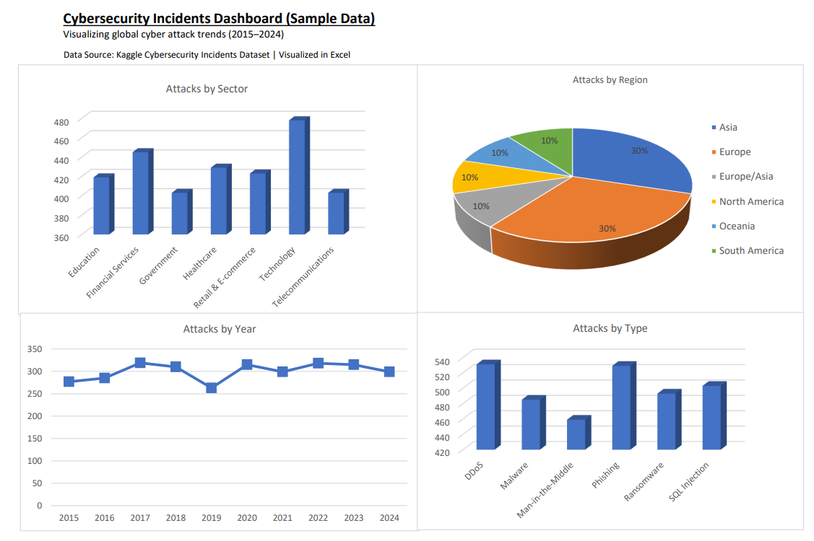

**Cybersecurity Incidents Dashboard**

## 📌 Overview
An Excel dashboard analyzing ~3,000 cybersecurity incidents (2015–2024) with trends by **sector**, **region**, **year**, and **attack type**.  
Built to demonstrate **data cleaning, pivot analysis, and dashboard design**.

## 🎯 Objectives
- Clean and standardize raw fields (countries → regions, sector normalization).
- Build pivot tables & visualizations.
- Communicate key insights clearly.

## 🗂 Dataset
- Source: Kaggle (sample cybersecurity incidents dataset).  
- Key fields: Country, Year, Attack Type, Sector, Financial Loss, Users Affected, Attack Source, Vulnerability Type, Defense Used, Resolution Hours.

## 🛠 Tools
- Microsoft Excel 2016 (PivotTables, charts, lookup tables).
- Basic data cleaning & mapping (MapRegion, MapSector).

## 📊 Key Insights
- **Top Attacked Sector:** [value from pivot]  
- **Most Affected Region:** [value from pivot]  
- **Trending Attack Type:** [value from pivot]  
- **Yearly Trend:** [short summary]  

## 📷 Dashboard Preview

## 📄 Files in Repo
- `Cybersecurity_Incidents_Dashboard.xlsx` — Full workbook (cleaned data, lookups, pivots, dashboard).  
- `Cybersecurity_Incidents_Dashboard.pdf` — Static report for sharing.  
- `Cybersecurity_Incidents_Dashboard.png` — Dashboard screenshot used in README preview.

## 🚀 Roadmap (Phase 2)
- Loss & users-affected analysis by attack type.  
- Mean resolution time by sector.  
- Interactive version in Google Data Studio.  
